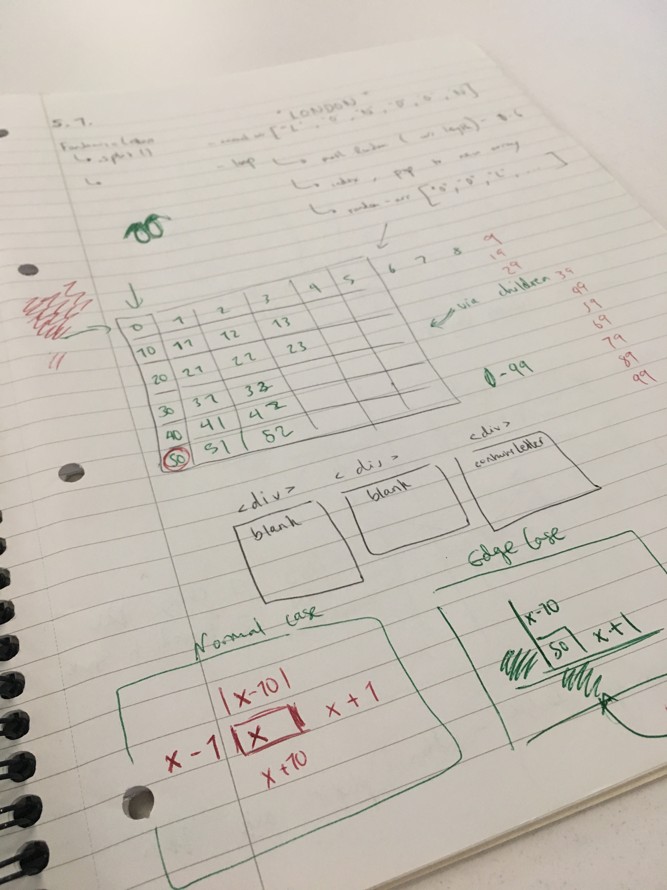

# GA WDI Project One - Gap Year Ninja

This was the first project assignment during my time on General Assembly's Web Development Immersive Course (week 3-4). I built a grid-based geography game which requires players to collect letters that make up a capital city name. Players compete against each other to collect the most cities possible to win.

<p align="center"></p>

##### [Visit website](https://stevanpopo.github.io/ga-wdi-project-one/) to play the game (the game was not designed for mobile).

## Brief
Design a two player game that works in the users browser. Players must be able to win and lose. The game should be built using HTML, CSS and Javascript (JQuery). We were given a week to build the project.

## Build Process
This was the first project were we worked independently for an extended period of time. Whilst we had guidance from our course leaders, the focus was on planning our own project from beginning to end and solving our own problems.

### Inspiration
In order to gain inspiration for my game I:
* Listed my areas of interest and brainstormed how they could be turned into games.
* Viewed complete game projects from our previous cohort.
* Looked at existing games on miniclip.com.
* Thought of classic board games and how they might be played as a digital game.

<p align="center"></p>


### Plan
I wanted to create a game that had an educational/learning element to it. I chose to move forward with a geography game that required users to correctly guess capital cities. Additionally, they would have to race to collect the letters that formed those cities by moving around a grid as quickly as possible.

Given the time constraints, I was keen to get to the build phase of the project as quickly as possible. I was also aware that a good plan would prevent me from running into issues later on. With that in mind, I:
* Created a list of all the features I wanted to create.
* Split the list by component parts of the game.
* organized the list by which elements were crucial for MVP and which could be added in later.
* Began to think about how to create those features, making notes of methods and data types that would be useful
* Tried to make sure each point on the plan was small enough that it could be solved indepedently (or google easily).

<p align="center"></p>

### Build
The build phase involved simply getting in front of my computer and tackling each element of the plan one by one, with a focus on getting to MVP as quickly as possible. It felt very satisfying to tick these off and mark them as done (in green).

<p align="center"></p>

### MVP
A key milestone was to get to MVP. This meant the game worked and was playable in a way that filled the brief (but was perhaps void of aesthetics and additional features). For my game, the key features for MVP where:
1. To have a grid that a player can move around on.
2. To have the game logic that outputs a randomized question (capital city) and have the letters assigned to grid positions.

I managed to get to MVP by day 3. I initially built the game as a 1 player game, thinking it would be easy enough to make two player later (more on this in refactoring section). I was pleased to reach this milestone in good time. It meant I had plenty of time to refine things and the build up to this point went very well.

<p align="center"></p>

### Refactor
My code was working, but I was aware of some faults:
* It was long and repetitive in places.
* Some functions had many, rather than singular concerns.
* Perhaps the major issue was that in building the game to work for one player, many of the functions contained hard coded variable changes specific to one player. The functions were therefore inflexible to work for a second player. They also relied on many arguments passed that held data about the player.

In order to refactor this:
* I rethought how I stored user data. Rather than storing strings, numbers and DOM elements as many singular variables for each player, I created arrays which stored both players data within them in global scope. I could then index these arrays based on the playerNumber (1 or 2) being passed as an argument in each function.
* This change allowed me to refactor almost every function, simplifying the number of arguments required to make each work.
* It also shortened each function as I no longer needed if/else statements to change functionality based on player.
* By abstracting the logic in this way, the app was also more semantic as the differences between players actions now happened where it most made sense in the app - where the user keys are different.

These changes allowed me to reduce the code by about 150 lines of code.

Below is an example of this in practice.

Before:

```
function moveLeft(indexChangeFunction, feedbackDiv, playerIndex){
  if (playerIndex === 0 || playerIndex % 10 === 0) {
    const msg = 'You can\'t move left. Try to move another direction.';
    displayFeedback(feedbackDiv, msg);

    if (player === 'player1'){
      // playerOneFeedback = 'You can\'t move left. Try to move another direction.';
      // displayFeedback();
      displayFeedback($playerOneFeedbackDisplay, msg);
    } else if (player === 'player2') {
      // playerTwoFeedback = 'You can\'t move left. Try to move another direction.';
      // displayFeedback();
      displayFeedback($playerTwoFeedbackDisplay, msg);
    }
  } else {
    indexChangeFunction(-1, playerIndex);
    if (player === 'player1'){
      playerOneIndexChange(-1, playerIndex);
    } else if (player === 'player2') {
      playerTwoIndexChange(-1, playerIndex);
    }
  }
}

```
After:
```
if (playerIndex === 0 || playerIndex % 10 === 0) {
  const msg = 'You can\'t move left. Try to move another direction.';
  displayFeedback(feedbackDiv, msg);
} else {
  indexChangeFunction(-1, playerIndex);
  }
}
```
The game now worked for two players.

<p align="center"></p>

### Challenges
- **Refactoring** - It was an initially painful process to break each part of my code and try to fix it again. Especially when at that stage I was quite proud of what I'd produced! It was humbling to understand that the initial code was actually pretty poor. Over the course of two days I found it immensely rewarding to improve though and I was much happier with the final result. The code was cleaner, shorter and easier to read.  
- **Versatile Randomisation** - My game involved randomising a few elements: questions, letters in the answer and positions on a grid. In order to keep the code DRY I managed to have one randomize function that shuffles arrays and was versatile enough to use in several places.
- **Game Resetting** - Understanding what data needs to be cleared at each round versus what needs to be cleared only when the whole game is complete. And then understanding how to call the helper functions so this all works seamlessly. I did this by createding to separate functions a) round reset and b) game reset that take care of different parts.
- **Silly mistakes!** - Like calling jQuery functions on non-JQuery objects.
- **Time & Stress & Productivity Management** - This was our first full week working independently and almost all of it coding. Part of the challenge was to understand how best to manage your own productivity, breaks and so on. I found this cool tool called [Rescuetime](#link) which gave me some data on how I worked over those first few days during the project.

<p align="center"></p>

### Bug Fixes
As I built the game, I indentified a few bugs that required fixing. In some cases, it was difficult to know exactly which function was causing the issue but it was satisfying to investigate. Some tough ones included:
* In my randomPositionAssign function (which assigns letters a grid position) in some instances it was assigning two letters to the same cell. This means the players can't complete the round. I thought I had solves this issue by introducing an array that checks if that cell position has already been taken. However it still occurred in rare cases. I realised this happens when the check confirms that cell position has been taken, but then randomly reassigns it onto a position which has also been taken. The solution was just to change it from a for to a while loop. Easy to fix, but tough to initially diagnose as it happened so rarely.
* When I reset the game I wanted the players to start back on their initial cells. However I was having a problem where the class wasn't being removed from their previous cell. After some digging, I realised I had cleared the array that stores player cell positions before the removeClass function had been called. Once I fixed the order of execution, it worked.
* I ran into an issue where letters were not clearing properly at the end of each round (image below), but instead piling up on a users grid. I fixed this by improving how my clearLetters function works.

<p align="center"></p>

## Moving Forward / Future Features
Some features I could add moving forward:
* Allow players to set game length by number of rounds/questions or length of time (as some rounds are quite long e.g. Europe).
* Allow players to set difficulty by reducing the time allowed in each round.
* I wanted to create a fun feature that would allow players to collect 'weapons' that gave them special abilities e.g. to reshuffle their opponents letters on grid or freeze there opponent for 10 seconds.
* Responsive. As my game is a race, responsiveness for two players didn't make as much sense. I could make it a timed game which players play one after the other and win based on their time to complete.

## Lessons Learned
* **Plan should include how to store data.** Whilst I thought I'd made a very detailed plan, it was an error to not think in more depth about how I stored data and how I'd need to access it later in the program. Moving forward I'll definitely think about this more.
* **Power of modular code.** Once I refactored my code, it became very easy to add additional features.
* **Call functions in their logical places.** I ran into a few issues where I had called functions somewhere that worked temporarily, but later in the process became the reason for a bug. In the future, from the beginning I'll think more about the best place to call certain functions.
* **Sometimes you just need to write it down.** For a few problems and bugs I ran into it really helped to write down and sketch out my thoughts. Visualising the problem helped me to understand it better and finally crack it.
* **Console.log everything when big fixing!**

<p align="center"></p>

## Other GA projects
* [Project Two (Express full-stack app)](https://github.com/stevanpopo/ga-wdi-project-two)
* [Project Three (MEAN stack app - group project)](https://github.com/stevanpopo/ga-wdi-project-three)
* [Project Four (MARN stack app)](https://github.com/stevanpopo/ga-wdi-project-three)

## Contact Me
Feel free to ask me questions about this project or anything else [on twitter](https://twitter.com/StevanPopo).

You can also find me on [LinkedIn](https://www.linkedin.com/in/stevanpopovic/) or over on [my personal site](http://www.stevanpopovic.com/).
